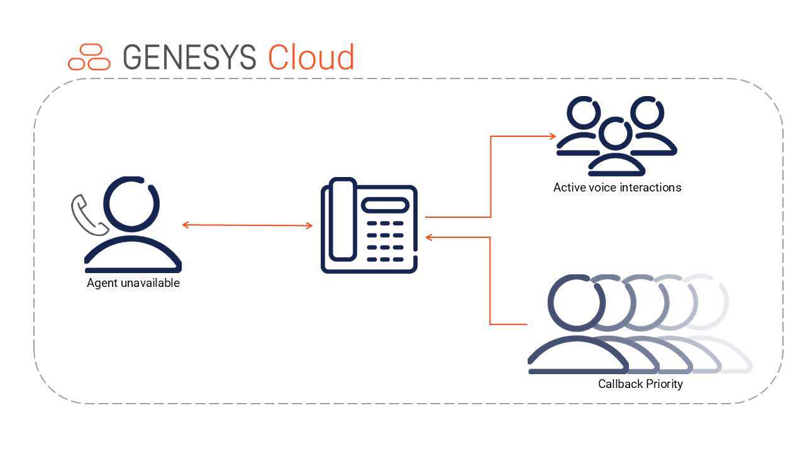

# Blacklisting Phone Numbers

This blueprint is intended to solve the prioritization issue with immediate callbacks.  If a customer is utilizing priority routing and updating the priority of calls in queue in the in-queue flow, immediate callbacks can lose their place in line as newer calls still waiting in queue wait long enough to increase priority above the initial priority of the callback.  This trigger will launch a workflow that acts similarly to reprioritization logic available in in-queue flows.  All settings for wait time before incrementing, priority incrementation value, etc. are intended to be customized by the customer to fit their reprioritization logic.

